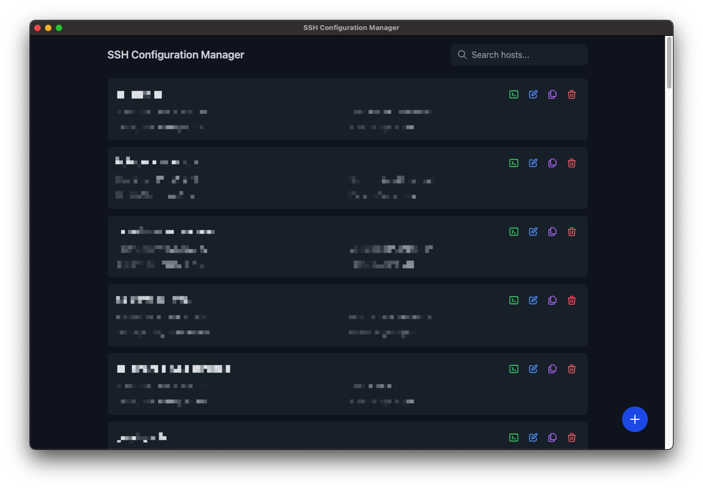

# SSH Editor

<div align="center">
  
  
  A modern, elegant desktop application to manage your SSH configurations with ease.
</div>

## ✨ Features

- 🎨 **Beautiful Dark Interface**: Modern, clean, and easy on the eyes
- 🔍 **Quick Search**: Instantly find your SSH configurations
- ✏️ **Easy Editing**: Edit your SSH configurations with a user-friendly form
- 🔄 **Clone Hosts**: Quickly duplicate and modify existing configurations
- 🚀 **Quick Connect**: Open your terminal with SSH command ready to go
- 💻 **Cross-Platform**: Works on macOS, Windows, and Linux

## 🚀 Installation

### Download

Download the latest version for your platform from the [Releases](https://github.com/YOUR_USERNAME/ssh-editor/releases) page.

### Build from Source

If you prefer to build from source, follow these steps:

```bash
# Clone the repository
git clone https://github.com/YOUR_USERNAME/ssh-editor.git
cd ssh-editor

# Install dependencies
npm install

# Run in development mode
npm run dev

# Build for production
npm run build
```

## 💡 Usage

1. **Launch the App**: Open SSH Editor
2. **View Configurations**: Your existing SSH configurations from `~/.ssh/config` will be loaded automatically
3. **Search**: Use the search bar to filter configurations by host, hostname, or username
4. **Add New**: Click the + button to add a new SSH configuration
5. **Edit**: Click the edit icon to modify an existing configuration
6. **Clone**: Use the clone button to duplicate a configuration
7. **Quick Connect**: Click the terminal icon to open your system terminal with the SSH command ready

## 🛠️ Configuration Options

- **Host**: The name you'll use to connect (e.g., `my-server`)
- **HostName**: The actual server address (e.g., `192.168.1.100`)
- **User**: Your username on the remote server
- **Port**: SSH port (default: 22)
- **IdentityFile**: Path to your SSH key
- **ForwardAgent**: Enable/disable SSH agent forwarding
- **ProxyJump**: Configure jump host for connecting through a bastion

## 🔒 Security

SSH Editor manages your `~/.ssh/config` file directly. It:
- Never stores passwords
- Never transmits your data anywhere
- Works completely offline
- Preserves your existing SSH config file format and comments

## 🤝 Contributing

Contributions are welcome! Feel free to:
- Report bugs
- Suggest new features
- Submit pull requests

## 📝 License

This project is licensed under the MIT License - see the [LICENSE](LICENSE) file for details.

## 🙏 Acknowledgments

- Built with [Electron](https://www.electronjs.org/)
- UI powered by [React](https://reactjs.org/) and [Tailwind CSS](https://tailwindcss.com/)
- Icons from [Heroicons](https://heroicons.com/) 